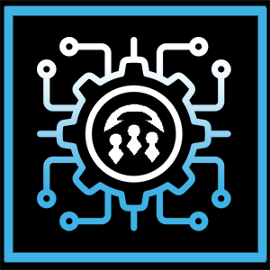
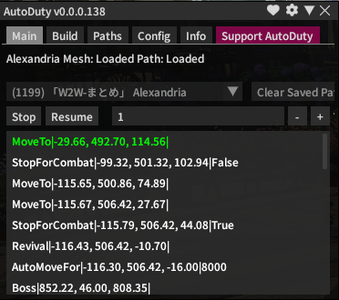
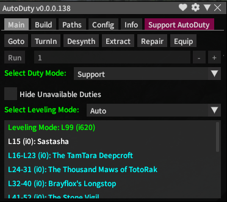

# AutoDuty

AutoDuty (AD) is a Dalamud plugin for FFXIV that serves as a tool to assist in the creation and following of paths through dungeons and duties. It's designed to enable automatic looping of instanced content with Duty Support, Trusts, or Squadrons.

Support for it can be found in the [this channel](https://discord.com/channels/1001823907193552978/1236757595738476725) of the [Puni.sh Discord server](https://discord.gg/punishxiv).

_Unlicensed code, which follows [default copyright law](https://docs.github.com/en/repositories/managing-your-repositorys-settings-and-features/customizing-your-repository/licensing-a-repository#choosing-the-right-license)_

# Dungeon Paths

Each dungeon supported by AutoDuty has a pre-configured path laid out, which should complete the dungeon without any issues. If any issues are encountered, make sure to reach out in the [support Discord](https://discord.gg/punishxiv).

The paths will also run over all loot containers and, when configured, will pick up the loot and do something with it while either in between dungeon runs or after your set amount of runs are over.

Creating paths is also supported and easily accomplished within AutoDuty by using the `Build` tab at the top. For path status, please refer to the [pinned spreadsheet](https://discord.com/channels/1001823907193552978/1236757595738476725/1243059104528994334) in the [AutoDuty channel](https://discord.com/channels/1001823907193552978/1236757595738476725) of the [support Discord](https://discord.gg/punishxiv).

# Automatic Leveling

AutoDuty has a leveling feature that will continuously run you through the "correct" dungeon to level through. The dungeon is typically determined by path quality, support for boss fights, and obviously the level of the dungeon.

With AutoDuty, you can level a job from 15 to the max level very quickly and fully AFK, provided you have the correct gear and the option in the AD configuration to automatically equip the best gear.

This plugin can also level trusts for you in the same way it levels your jobs. It can intelligently select trust members and level them all to max, fully AFK.

# Automations

AutoDuty supports a wide range of automations and integrations with other plugins. Below are just some of what AD can offer while automating instanced content:

| Before runs | During the run | Between runs | After the runs |
| -------- | -------- | -------- | -------- |
| Move to an inn, house, or FC house   Auto self- or NPC- repair   Execute commands (i.e. SND scripts)   Auto consume items | Loot treasure coffers   Manage plugin states | Auto extract materia   Auto desynth loot   Auto turn in loot to GC   Use AutoRetainer   Auto equip best gear | Stop looping at a level   Stop looping when you run out of rested XP   Turn on AutoRetainer multi mode   Shut down your computer |

# Installation

Add `https://puni.sh/api/repository/herc` to your plugin repositories and then search for `AutoDuty` in the Plugin Installer to install AutoDuty.

Settings can be accessed via the Plugin Installer or using the chat command `/ad`.

## Required Plugins

Additionally, the following plugins are required. Right-click the name of the plugin and copy the URL to use it to add to your repositories in-game.

- [vnavmesh](https://puni.sh/api/repository/veyn): Automatic navigation with waypoints
- [Wrath Combo](https://github.com/PunishXIV/WrathCombo) or [Rotation Solver Reborn](https://raw.githubusercontent.com/FFXIV-CombatReborn/CombatRebornRepo/main/pluginmaster.json): Automatic rotation execution, all jobs supported
- [Veyn's Boss Mod](https://puni.sh/api/repository/veyn) or [BossmodReborn](https://raw.githubusercontent.com/FFXIV-CombatReborn/CombatRebornRepo/main/pluginmaster.json): Automatic fight execution for bosses

## Optional Plugins

The following plugins are optional. They integrate with AutoDuty well and in some cases can be triggered by AD itself.

- [Gearsetter](https://plugins.carvel.li): Automatically finds equipment upgrades in your inventory
- [AutoRetainer](https://love.puni.sh/ment.json): Automatically manages your retainers and submersibles as well as sends them out on ventures
 
# Getting help

When you've found a bug or think you have an issue with the plugin, please ask in [this channel](https://discord.com/channels/1001823907193552978/1236757595738476725) in the [Puni.sh Discord server](https://discord.gg/punishxiv). It might be a known issue or people might be able to help you quickly. Additionally, sometimes it might be an issue with one of the required plugins. Users in Discord will be able to help triage the issue and send you to the right place.

Best practice is to not say "I died in this dungeon and I don't know why." Please make sure to include as much detail as possible. What boss were you on? Did you get stuck in a specific spot?

For support with Veyn's Boss Mod and vnavmesh, please ask in [this channel](https://discord.com/channels/1001823907193552978/1191076246860349450) in the [Puni.sh Discord server](https://discord.gg/punishxiv),
or support for Wrath Combo in [this channel](https://discord.com/channels/1001823907193552978/1271175781569003590) in the Puni.sh server. For support with BossModReborn and 
Rotation Solver Reborn, please ask in the [Combat Reborn Discord server](https://discord.gg/p54TZMPnC9).

Lastly, feel free to create issues with feature requests and bug reports.
